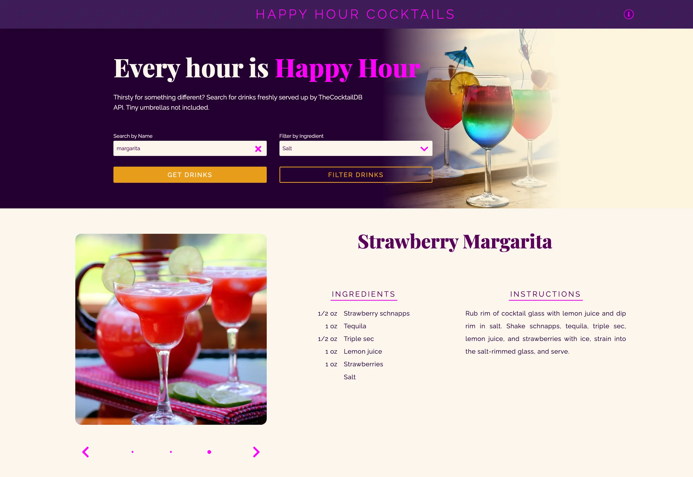

# Happy Hour Cocktails
Thirsty for something different? Search for drinks freshly served up by TheCocktailDB API. Tiny umbrellas not included.

**[Visit live site](https://acopperlily.github.io/happy-hour-cocktails)**

## How It's Made:

**Tech Used:** 
-  Vite
-  React
-  HTML
-  CSS
-  JavaScript

This is a React project created using Vite. By using the Fetch API, requests are made to the TheCocktailDB API. The API returns a list of drink information including photos, ingredients, and mixing instructions. You can then filter the drink list by selecting an ingredient.

## Optimizations

I would like to automate the image carousel by implementing features like play and pause.

## Lessons Learned:

Cycling through images can be tricky! I learned how to implement both arrows and navigation dots to produce a seamless scrolling effect with the drink images.

## More Examples:

**[Digital Canvas](https://acopperlily.github.io/digital-canvas)**

**[Catalyzer](https://catalyzer.netlify.app)**

**[Cats On Demand](https://acopperlily.github.io/cats-on-demand)**
